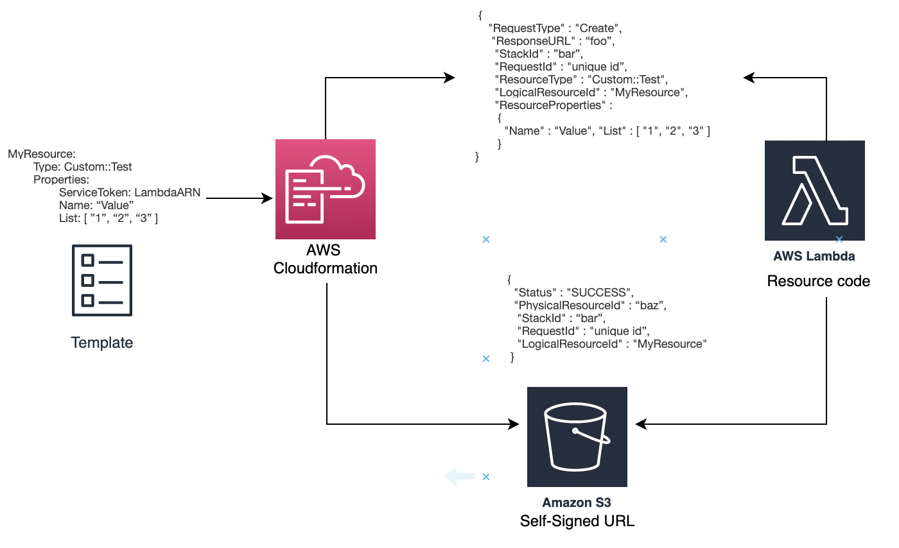
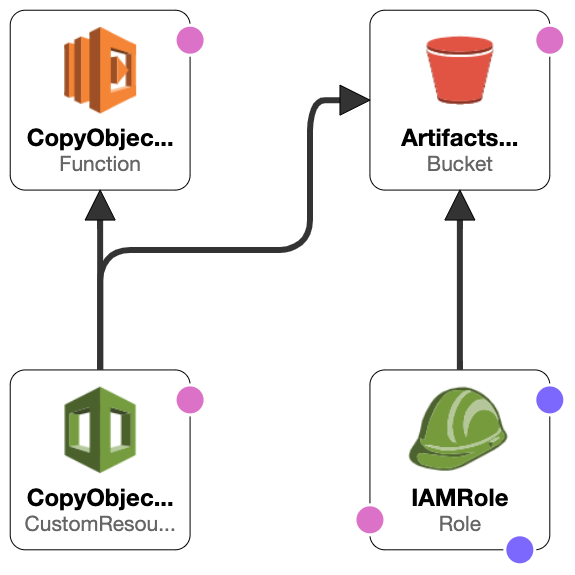

## Custom resources

1. What is AWS Cloudformation?

    - AWS CloudFormation offers an easy way to deploy a collection of related AWS and third-party resources, provision them faster, and manage them throughout their lifecycles, by treating infrastructure as code. 

    - A CloudFormation template contains information for the desired resources and their dependencies so we can launch and configure them together as a stack. We can use templates to create, update, and delete an entire stack as a single unit, instead of managing resources individually. We can also manage and provision stacks across multiple AWS accounts and AWS Regions.

    - However, Cloudformation fails at certain places, such as executing a lambda via deploying the stacks or needing to know the CIDR Block for the VPC from a given VPC ID. There we can leverage AWS CloudFormation Custom Resource to overcome these loopholes

2. What are CloudFormation Custom Resources?

    - A custom resource is a custom type powered by a Lambda function to execute a task that CloudFormation cannot do, for example, retrieving an AMI ID or the CIDR block for a VPC. 
    
    - Custom resources have a “request type” included with the request, allowing the custom resource to create, update and delete whatever it is doing. Outside to just normal lookup, there are more capabilities an AWS CloudFormation Custom Resource can provide

3. How Does the Custom Resource Work?
      
      

    - Let's assume we are deploying the below custom resource as part of the CloudFormation template.
    
        ```MyResource:
        Type: Custom::Test
        Properties:
            ServiceToken: LambdaARN
            Name: “Value”
            List: ["1","2","3","4"]
         ```
         
    - When CloudFormation runs the above input, it uses the ServiceToken to lookup the Lambda function it is aspected to invoke and sends the parameters to that function.
        
        ``` {
              "RequestType" : "Create",
              "ResponseURL" : “foo”,
              "StackId" : ”bar”,
              "RequestId" : "unique id”,
              "ResourceType" : "Custom::Test",
              "LogicalResourceId" : "MyResource",
              "ResourceProperties" :
               {
                 "Name" : "Value", 
                 "List" : [ "1", "2", "3" ]
               }
             }
         ``` 

    - The request also contains a pre-signed URL leveraged by the Lambda function to return the response. All of the interaction between the custom resource and CloudFormation is conducted via this pre-signed URL. If the custom resource doesn’t return the information to the pre-signed URL, the CloudFormation will not complete. If we don't specify a timeout for the stack creation, the stack will hang for hours.

        ```{
              "RequestType": "Create", 
              "ServiceToken": LambdaARN, 
              "ResponseURL": "foo",
              "StackId": "bar", 
              "RequestId": "unique id", 
              "LogicalResourceId": "MyResource", 
              "ResourceType’: "Custom::Test", 
              "ResourceProperties":{
                "ServiceToken": LambdaARN, 
                "Name" : "Value", 
                "List" : [ "1", "2", "3" ]
                }
              }
         ```

    - In this sample request, there are several entries:

        - RequestType: It holds either create, update or delete. And used to assist the custom resource to decide what to do

        - ServiceToken: service token holds Custom resource ARN where CloudFormation needs to send the requests

        - ResponseURL: This is the pre-signed URL where the response must be sent back to the CloudFormation.

        - StackId: stack ID contains the custom resource request.

        - RequestId: AWS provided an unique request ID.

        - LogicalResourceId: name of the logical resource as it appears in the stack.

        - ResourceType: name of the resource as mentioned in the stack.

        - ResourceProperties: parameters that are provided to the function.

    - After the custom resource function executes, it returns the following response to CloudFormation using the pre-signed URL provided in the Request data.
     
         ```{
            "Status" : "SUCCESS",
            "PhysicalResourceId" : “baz”,
             "StackId" : “bar”,
             "RequestId" : "unique id”,
             "LogicalResourceId" : "MyResource"
           } 
         ```

    - Next, CloudFormation continues the execution with the rest of the stack deployment operations

4. Demo 

    - Consider a scenario where a CloudFormation template creates a new S3 bucket during deployment and deletes this bucket during stack teardown. If this S3 bucket holds any objects, then deletion will fail because CloudFormation service can delete only empty buckets. This will cause entire teardown operation to fail and CloudFormation service will not proceed with deleting rest of the resources. To work around this problem, we can use a lambda-backed custom resource. During teardown, this lambda can delete all the objects in the S3 bucket. Then, CloudFormation can proceed to delete the empty bucket.

    - The following diagram shows the architectural components of the solution:
    
        

    - Link for Cloudformation 
    
    - Link for Custom Resource Lambda
